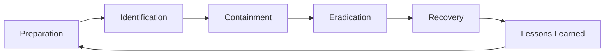

# **COMPREHENSIVE MALWARE COUNTERMEASURES**

Here's a detailed breakdown of defensive strategies across technical, procedural, and human layers to combat modern malware threats.

---

## **DEFENSE-IN-DEPTH FRAMEWORK**

### **Layer 1: PREVENTION**

#### **1.1 Endpoint Protection**
- **Next-Gen Antivirus (NGAV):** Behavior-based, ML-driven detection
- **Endpoint Detection & Response (EDR/XDR):** Continuous monitoring and investigation
- **Application Control:**
  - **Application Whitelisting:** Only approved software runs
  - **AppLocker/Software Restriction Policies** (Windows)
  - **Gatekeeper** (macOS)
  - **SELinux/AppArmor** (Linux)

#### **1.2 Network Security**
- **Next-Gen Firewalls:** Deep packet inspection, IPS/IDS
- **Web/Email Gateways:** Filter malicious content before delivery
- **DNS Security:** Block malicious domains via DNS filtering
- **Network Segmentation:** Isolate critical assets; Zero Trust microsegmentation
- **VPN & Encryption:** Protect data in transit

#### **1.3 Email Security**
- **SPF/DKIM/DMARC:** Prevent email spoofing
- **Attachment Sandboxing:** Execute suspicious files in isolated environment
- **URL Analysis:** Time-of-click protection
- **AI-based Filtering:** Detect sophisticated phishing

#### **1.4 Vulnerability Management**
- **Regular Patching:** Critical/High vulnerabilities within 7-30 days
- **Patch Management Automation:** WSUS, SCCM, third-party tools
- **Vulnerability Scanning:** Regular assessments
- **Asset Inventory:** Know what needs protection

---

### **Layer 2: DETECTION**

#### **2.1 Behavioral Monitoring**
- **UEBA:** User and Entity Behavior Analytics
- **Network Traffic Analysis:** Detect anomalies, C2 communications
- **File Integrity Monitoring:** Detect unauthorized changes
- **Memory Analysis:** Detect fileless malware

#### **2.2 Signature & Heuristic Detection**
- **YARA Rules:** Custom pattern matching
- **Sigma Rules:** Standardized detection rules
- **IOC Monitoring:** Indicators of Compromise tracking
- **Threat Intelligence Feeds:** Real-time threat data

#### **2.3 Deception Technologies**
- **Honeypots:** Decoy systems to attract attackers
- **Canary Tokens:** Track data/file access
- **Deceptive Credentials:** Monitor for credential theft attempts

#### **2.4 SIEM & Analytics**
- **Security Information & Event Management:** Centralized log analysis
- **SOAR:** Automated response workflows
- **Threat Hunting:** Proactive search for adversaries

---

### **Layer 3: RESPONSE**

#### **3.1 Incident Response Plan**


#### **3.2 Containment Strategies**
- **Network Isolation:** Disconnect infected systems
- **Account Locking:** Disable compromised accounts
- **Process Termination:** Kill malicious processes
- **DNS Sinkholing:** Redirect C2 traffic to controlled servers

#### **3.3 Eradication & Recovery**
- **System Reimaging:** Clean rebuild from trusted sources
- **Malware Removal Tools:** Dedicated removal utilities
- **Forensic Analysis:** Determine root cause
- **Backup Restoration:** From known-clean backups

---

## **TECHNICAL COUNTERMEASURES BY THREAT TYPE**

### **Against Ransomware:**
- **Immutable Backups:** 3-2-1 Rule (3 copies, 2 media, 1 offsite)
- **Application Whitelisting:** Block unauthorized executables
- **File Change Monitoring:** Detect mass encryption
- **Controlled Folder Access** (Windows Defender)
- **Network Segmentation:** Limit lateral movement
- **Email Attachment Restrictions:** Block .exe, .js, .vbs, .ps1

### **Against Trojans & Backdoors:**
- **Least Privilege Principle:** Limit user/application permissions
- **Network Access Control:** Validate devices before network access
- **Outbound Traffic Filtering:** Block unusual destinations/ports
- **Regular Credential Rotation:** Change default/service accounts
- **MFA Everywhere:** Especially for critical systems

### **Against Fileless Malware:**
- **PowerShell Constraints:** Disable/restrict PowerShell execution
- **AMSI Integration:** Anti-Malware Scan Interface monitoring
- **Memory Protection:** Block execution from non-executable memory
- **Script Block Logging:** Monitor PowerShell/VBScript execution
- **LOLBAS Monitoring:** Detect Living-off-the-Land attacks

### **Against Supply Chain Attacks:**
- **Software Bill of Materials (SBOM):** Know your software components
- **Code Signing Enforcement:** Require valid digital signatures
- **Third-Party Risk Management:** Assess vendor security
- **Software Composition Analysis:** Scan for vulnerable libraries

---

## **HUMAN-CENTRIC DEFENSES**

### **Security Awareness Training:**
- **Phishing Simulations:** Regular testing with immediate feedback
- **Interactive Training:** Gamified learning modules
- **Role-Based Training:** Customized for different job functions
- **Continuous Reinforcement:** Not just annual training

### **Reporting Culture:**
- **Easy Reporting Channels:** Simple "Report Phish" button
- **No-Blame Policy:** Encourage reporting without fear
- **Quick Response:** Acknowledge and act on reports

### **Procedural Controls:**
- **Change Management:** Formal process for system changes
- **Segregation of Duties:** Critical actions require multiple people
- **Incident Response Drills:** Tabletop exercises regularly

---

## **ORGANIZATIONAL CONTROLS**

### **Security Frameworks & Compliance:**
- **NIST Cybersecurity Framework:** Identify, Protect, Detect, Respond, Recover
- **ISO 27001:** Information security management
- **CIS Controls:** 18 critical security controls
- **PCI DSS:** For payment card data
- **GDPR/HIPAA:** Data protection regulations

### **Risk Management:**
- **Regular Risk Assessments:** Identify and prioritize risks
- **Third-Party Audits:** Independent security reviews
- **Cyber Insurance:** Transfer residual risk

### **Governance:**
- **Security Policies:** Clear, enforceable, regularly updated
- **Management Buy-in:** Security as business priority
- **Budget Allocation:** Adequate security funding

---

## **ADVANCED/EMERGING COUNTERMEASURES**

### **AI & Machine Learning:**
- **Behavioral Anomaly Detection:** ML models learn normal patterns
- **Predictive Analytics:** Identify likely attack vectors
- **Automated Threat Intelligence:** Real-time analysis of global threats

### **Zero Trust Architecture:**
- **Never Trust, Always Verify:** Every request authenticated
- **Microsegmentation:** Granular network segmentation
- **Identity-Centric Security:** Focus on user/device identity

### **Hardware-Based Security:**
- **TPM & Secure Boot:** Hardware-rooted trust
- **Memory Encryption:** AMD SEV, Intel SGX
- **Hardware Security Modules:** For cryptographic operations

### **Cloud-Specific Defenses:**
- **Cloud Security Posture Management:** Continuous compliance monitoring
- **Cloud Workload Protection:** Container/Kubernetes security
- **CASB:** Cloud Access Security Broker

---

## **SPECIFIC TOOLS & TECHNOLOGIES**

### **Endpoint Security Suite:**
```
Microsoft Defender for Endpoint
CrowdStrike Falcon
SentinelOne
CylancePROTECT
Carbon Black
```

### **Network Security:**
```
Palo Alto Networks NGFW
Cisco Firepower
Fortinet FortiGate
Check Point
Zscaler (cloud-based)
```

### **Email Security:**
```
Proofpoint
Mimecast
Microsoft Defender for Office 365
Cisco Email Security
```

### **Backup Solutions (Anti-Ransomware):**
```
Veeam Immutable Backups
Rubrik
Cohesity
Druva
```

### **Deception Technology:**
```
Attivo Networks
TrapX Security
CounterCraft
Illusive Networks
```

---

## **OPERATIONAL BEST PRACTICES**

### **Regular Activities:**
1. **Weekly:**
   - Review critical security alerts
   - Check backup integrity
   - Update threat intelligence feeds

2. **Monthly:**
   - Vulnerability scans
   - Phishing simulation
   - Log review/audit
   - Patch compliance reporting

3. **Quarterly:**
   - Full security assessment
   - Incident response drill
   - Policy review
   - Third-party risk review

4. **Annually:**
   - Penetration testing
   - Security awareness training refresh
   - Disaster recovery test
   - Complete risk assessment

### **Detection Tuning:**
- **Reduce False Positives:** Tune alerts to minimize noise
- **Threat Hunting:** Proactively search for threats
- **Baseline Normal Behavior:** Know what's normal to spot anomalies

---

## **RECOVERY & BUSINESS CONTINUITY**

### **Backup Strategy (3-2-1-1-0):**
- **3** copies of data
- **2** different media types
- **1** copy offsite
- **1** immutable copy
- **0** errors in recovery testing

### **Disaster Recovery:**
- **RTO/RPO Defined:** Recovery Time/Point Objectives
- **Documented Procedures:** Step-by-step recovery guides
- **Regular Testing:** Ensure recovery actually works

### **Communication Plan:**
- **Stakeholder Notification:** Who needs to know and when
- **Public Relations:** Handling media inquiries
- **Customer Communication:** Transparency with customers

---

## **MEASURING EFFECTIVENESS**

### **Key Security Metrics:**
- **MTTD:** Mean Time to Detect (aim for <1 hour)
- **MTTR:** Mean Time to Respond (aim for <24 hours)
- **Patch Compliance:** >95% critical patches within 30 days
- **Phishing Click Rate:** <5% of users
- **Backup Success Rate:** >99% successful backups
- **Incident Volume:** Track trends over time

### **Maturity Assessment:**
- **Initial:** Ad-hoc, reactive
- **Managed:** Basic policies, some monitoring
- **Defined:** Formal processes, regular testing
- **Measured:** Metrics-driven improvement
- **Optimized:** Continuous improvement, proactive defense

---

## **COMMON PITFALLS TO AVOID**

1. **"Silver Bullet" Mentality:** No single solution solves everything
2. **Set-and-Forget:** Security requires continuous effort
3. **Over-Reliance on Technology:** People and processes matter too
4. **Poor Password Policies:** Still a major vulnerability
5. **Inadequate Backup Testing:** Backups fail when needed most
6. **Ignoring Insider Threats:** Employees cause 30% of breaches
7. **No Incident Response Practice:** Unprepared teams fail under pressure

---

## **FUTURE TRENDS IN MALWARE DEFENSE**

### **Predictive Security:**
- Using AI to predict attack vectors before exploitation
- Threat modeling based on organizational profile

### **Autonomous Response:**
- Automated containment and remediation
- Self-healing systems that detect and fix issues

### **Quantum-Resistant Cryptography:**
- Preparing for quantum computing threats
- Post-quantum cryptographic algorithms

### **Extended Detection & Response (XDR):**
- Unified security across endpoints, networks, cloud
- Better correlation and automation

### **Privacy-Enhancing Technologies:**
- Secure data processing without exposing sensitive information
- Federated learning for threat intelligence sharing

---

## **BOTTOM LINE**

Effective malware countermeasures require:
1. **Layered Defense:** No single point of failure
2. **Continuous Improvement:** Security evolves as threats evolve
3. **Balanced Approach:** People, process, and technology
4. **Proactive Posture:** Assume breach, hunt for threats
5. **Business Alignment:** Security enables, doesn't hinder, business

**Remember:** The goal isn't perfect security (impossible), but **resilience** - the ability to prevent most attacks, detect those that get through quickly, respond effectively, and recover with minimal impact.

The most effective security programs focus on **risk management** rather than **risk elimination**, prioritizing defenses based on actual business risk and continuously adapting to the changing threat landscape.
